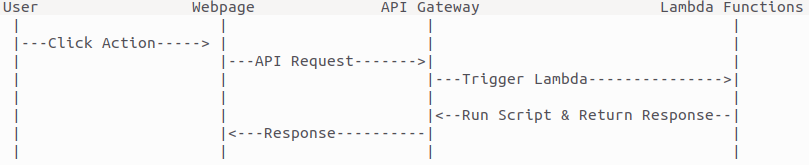

# Sample Webpage to Run Lambda Function via API Gateway

---

## Introduction

This project provides three different scripts for various purposes, which can be deployed as AWS Lambda functions and triggered via API Gateway. Each script addresses a unique task and interacts with other AWS services as needed.

---

## Project Flow

  

---

## Features

- Convert a given CSV file in S3 to an XLSX file.
- Add a given Wikipedia page's topic to a text file in S3.
- Add users from a specified sheet URL to a GitLab server and create a new repository for each user.

---

## Prerequisites

- A python IDE for editing the scripts to your values
- An AWS account with permissions to create and manage Lambda functions and API Gateway
- Basic knowledge of deploying Lambda functions and configuring API Gateway

---

